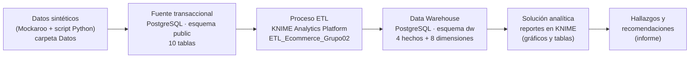

# ProyectoI_BusinessIntelligence

Proyecto 01 · TI6900 Inteligencia de Negocios · Instituto Tecnológico de Costa Rica · II Semestre 2026
Grupo 02 · **Tema 2: Plataforma de comercio electrónico**

## Problema

Una organización opera una plataforma de comercio electrónico que vende productos de distintas categorías y marcas por canales digitales, con varios métodos de pago, campañas de marketing periódicas y operadores logísticos externos para las entregas. La información de pedidos, catálogo, devoluciones y envíos se encuentra dispersa, por lo que no es posible responder de forma ágil ni confiable preguntas clave para la operación.

La solución de Inteligencia de Negocios integra estos procesos en un modelo dimensional para responder las preguntas obligatorias del tema:

1. ¿Qué categorías, productos, marcas y campañas generan más pedidos, ingresos y margen por periodo?
2. ¿Cómo se comportan los tiempos de entrega y el porcentaje de entregas a tiempo según operador logístico, región y tipo de envío?
3. ¿Qué productos presentan mayores tasas de cancelación o devolución y cuáles son las razones más frecuentes?
4. ¿Cómo varían el ticket promedio y la recurrencia de compra según segmento de cliente, dispositivo y método de pago?

Además, se desarrolló un indicador adicional: **margen bruto promedio por pedido**.

## Arquitectura de la solución



| Capa | Descripción |
|---|---|
| Fuente transaccional | Base `ecommerce_bi`, esquema `public`: Cliente, Categoria, Marca, Campania, OperadorLogistico, Producto, Pedido, DetallePedido, Envio y DevolucionCancelacion (10.287 registros). |
| Modelo dimensional | Esquema `dw` con una constelación de hechos: `fact_pedido`, `fact_detalle_venta`, `fact_envio` y `fact_devolucion_cancelacion`, con dimensiones conformadas (`dim_tiempo`, `dim_cliente`, `dim_producto`, `dim_campania`, `dim_contexto_pedido`, `dim_operador_logistico`, `dim_contexto_envio`, `dim_motivo_evento`) y llaves subrogadas. |
| ETL | Workflow de KNIME que vacía `dw`, carga dimensiones, resuelve llaves subrogadas y carga los hechos; termina con 32 controles de calidad. |
| Solución analítica | Dos workflows de KNIME, `Persona4_Analisis` (Q1 y Q2) y `Persona5_Analisis` (Q3, Q4 e indicador adicional), que consultan únicamente el esquema `dw` y presentan los resultados en gráficos de barras y tablas. |

### Respuesta a las preguntas de negocio

| Pregunta | Workflow | Evidencias |
|---|---|---|
| Q1. Pedidos, ingresos y margen por categoría, producto, marca, campaña y periodo | `Persona4_Analisis.knwf` | `Solucion Analitica/Evidencias/Persona 4/` (Q1_01 a Q1_09) |
| Q2. Tiempos de entrega y % de entregas a tiempo por operador, región y tipo de envío | `Persona4_Analisis.knwf` | `Solucion Analitica/Evidencias/Persona 4/` (Q2_01 a Q2_07) |
| Q3. Tasas de cancelación y devolución por producto y razones más frecuentes | `Persona5_Analisis.knwf` | `Solucion Analitica/Evidencias/Persona 5/` |
| Q4. Ticket promedio y recurrencia por segmento, dispositivo y método de pago | `Persona5_Analisis.knwf` | `Solucion Analitica/Evidencias/Persona 5/` |
| Indicador adicional: margen bruto promedio por pedido (₡145.924,90 sobre 2.500 pedidos) | `Persona5_Analisis.knwf` | `Solucion Analitica/Evidencias/Persona 5/` |

La interpretación de los resultados, las conclusiones, las limitaciones y las mejoras futuras se desarrollan en el informe del proyecto.

## Integrantes

- Mirka Araya Quirós
- Jose Eduardo Soto Hernández
- Alexandra Pamela Cruz Segura
- Francisco Alejandro Díaz Palma
- Sharon Sánchez

## Herramientas utilizadas

| Herramienta | Uso |
|---|---|
| PostgreSQL 16 o superior | Fuente transaccional (`public`) y Data Warehouse (`dw`). |
| pgAdmin 4 | Ejecución de scripts y verificación de datos. |
| KNIME Analytics Platform 5 | Proceso ETL y solución analítica. |
| Mockaroo | Generación de las tablas de catálogo sintéticas. |
| Python | Generación de las tablas transaccionales con llaves foráneas válidas. |
| GitHub | Control de versiones y trabajo colaborativo. |

## Instrucciones de ejecución

1. Crear en PostgreSQL una base de datos llamada `ecommerce_bi`.
2. En el Query Tool de pgAdmin, ejecutar en este orden:
   1. `Base de Datos/ScriptBD_Proyecto1BI.sql`: crea la fuente transaccional.
   2. `ETL/Scripts SQL/01_carga_datos_fuente.sql`: carga los datos de la carpeta `Datos`.
   3. `Data Warehouse/modelo_dimensional.sql`: crea el esquema `dw`.
3. En KNIME, importar y ejecutar `ETL/Workflow KNIME/ETL_Ecommerce_Grupo02.knwf` (detalle en `ETL/README.md`). Al terminar, los 32 controles de validación deben quedar en `OK`.
4. Importar y ejecutar con **Execute all** los workflows de la solución analítica (detalle en `Solucion Analitica/README.md`):
   - `Solucion Analitica/Workflow KNIME/Persona4_Analisis.knwf`: preguntas 1 y 2.
   - `Solucion Analitica/Workflow KNIME/Persona5_Analisis.knwf`: preguntas 3 y 4 e indicador adicional.

   En cada workflow se deben indicar el usuario y la contraseña de PostgreSQL de la computadora local. Cada vista se consulta seleccionando el nodo Bar Chart o Table View correspondiente.

Resultado esperado del Data Warehouse: 2.500 pedidos, 4.117 líneas de venta, 2.500 envíos y 480 eventos de devolución o cancelación.

## Estructura del repositorio

```
ProyectoI_BusinessIntelligence/
├── Base de Datos/            Script de la fuente transaccional y diagramas conceptual y ER
├── Datos/                    Datos sintéticos en CSV (10 tablas)
├── Data Warehouse/           Script del modelo dimensional y diagrama
├── ETL/                      Scripts SQL, workflow de KNIME, reglas de transformación y evidencias
├── Solucion Analitica/       Solución analítica de las preguntas de negocio
│   ├── Workflow KNIME/       Persona4_Analisis.knwf (Q1 y Q2) y Persona5_Analisis.knwf (Q3, Q4 e indicador)
│   ├── Consultas SQL/        Consultas de las preguntas 1 y 2
│   └── Evidencias/           Capturas de las vistas: Persona 4/ y Persona 5/
└── README.md
```

Las carpetas `Data Warehouse`, `ETL` y `Solucion Analitica` incluyen su propio README con el detalle de su contenido.
